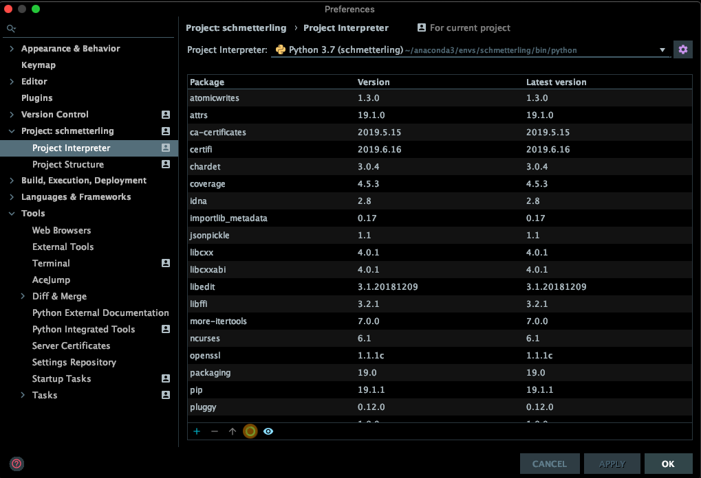
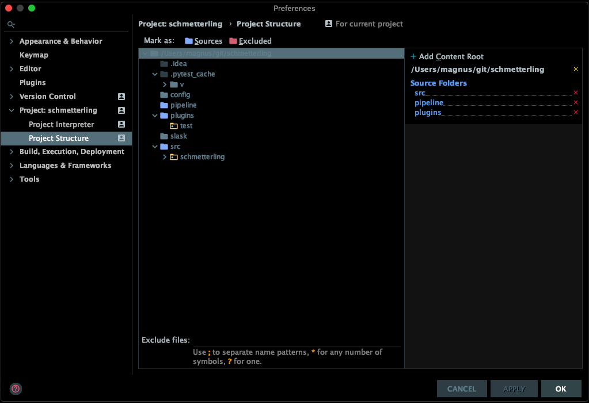

## Environment setup

### Virtual environment

1. conda create -n schmetterling python=3.7 jsonpickle more-itertools pytest pytest-cov
2. conda activate schmetterling
3. pip install schedule
4. pip install vang

### PyCharm

1. Import project into PyCharm
2. In preferences, update "Project Interpreter" and "Project Structure":

### Run

1. Create a pipeline that suits your needs - see examples in the pipeline directory
2. Include the src directory and your pipeline in PYTHONPATH - see example in run.sh
3. Run with 

       python3 your_pipeline.py
       
### Custom steps

1. Add custom steps to your pipeline by placing them in a directory added to your PYTHONPATH and configure them in your pipeline - see examples in the plugin directory

